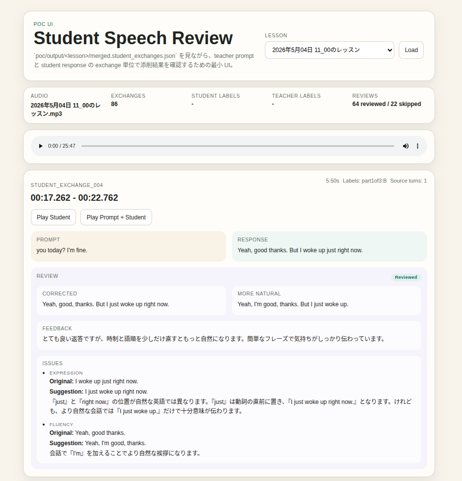

<h1 align="center">Speaking Review Tools</h1>

This tool is designed for English learners, especially those using DMM Eikaiwa. It transcribes the recording data available on your portal page and helps improve your utterances.

<p align="center">
  
</p>

## How to Use

1. Transcribe the recording data

```bash
uv run python poc/build_lesson_review_bundle.py "data/2026年5月04日 11_00のレッスン.mp3
```

2. Start the local app:

```bash
uv run uvicorn app:app --app-dir poc/ui_student_turns --reload
```

3. Open the app in your browser:

```text
http://127.0.0.1:8000
```

## Requirements

- Python 3.10+
- uv
